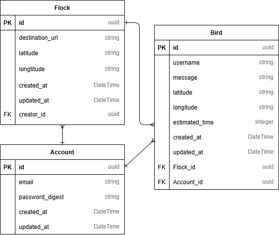

# Flocks API

Flocks API is a web application designed to store and share locations between friends. Users can create groups (flocks) with whom they want to share location information. Users can also choose to share their own location on maps.

## Overview

This application allows users to:

- Create location-sharing groups (flocks)
- Pin meeting places on maps
- Share their current location with group members
- Track other users' locations to estimate arrival times
- Securely manage user accounts and location information

For example, when friends decide to meet at a restaurant, one user can pin the location on the map, allowing everyone in the group to see it. Group members can also share their real-time locations, making it easy to see if someone is running late.

## Entity Relationship Model



### Entity Relationships

- **Account to Flock**: One-to-many relationship (creator_id). An account can create multiple flocks.
- **Account to Bird**: One-to-many relationship. An account can have multiple bird records in different flocks.
- **Flock to Bird**: One-to-many relationship. A flock can contain multiple birds (users).
- The Bird entity serves as a join table, implementing a many-to-many relationship between accounts and flocks they've joined (separate from flocks they've created).

## Models

### Account

Represents a user of the application.

- `id`: UUID primary key
- `email`: User's email (unique)
- `password_digest`: Encrypted password
- Relationships:
  - Has many created flocks
  - Has many joined flocks through birds

### Flock

Represents a group with a shared destination.

- `id`: UUID primary key
- `creator_id`: Foreign key to the account that created the flock
- `destination_url`: Google Maps URL for the meeting location
- Relationships:
  - Belongs to a creator (Account)
  - Has many birds

### Bird

Represents a user within a flock.

- `id`: Integer primary key
- `flock_id`: Foreign key to the flock
- `account_id`: Foreign key to the account
- `username`: User's name within the flock
- `message_secure`: Encrypted status message
- `latitude_secure`: Encrypted current latitude
- `longitude_secure`: Encrypted current longitude
- `estimated_time`: Estimated time to arrival in seconds
- Relationships:
  - Belongs to an account
  - Belongs to a flock

## System Architecture

The application uses a Model-View-Controller (MVC) architecture with service objects:

- **Models**: Account, Flock, Bird
- **Controllers**: API routing (Roda)
- **Service Objects**: Encapsulate business logic like creating flocks, adding birds, etc.

## Service Objects

The application uses service objects to handle business logic:

- `CreateFlock`: Creates a new flock with a creator
- `AddBirdToFlock`: Adds a bird (user) to an existing flock
- `UpdateBird`: Updates a bird's message and location
- `UpdateDestination`: Updates a flock's destination (only by creator)

## Requirements

- Ruby (>=3.0.0)
- Bundler (>=2.0.0)
- PostgreSQL database

### Dependencies

#### Web API

- base64 (~>0.1.0)
- json (~>2.6.0)
- logger (~>1.0)
- puma (~>6.0)
- roda (~>3.0)
- sequel: ORM for database operations

#### Security

- rbnacl (~>7.0): For encryption of sensitive data

#### Testing

- minitest (~>5.0)
- minitest-rg (~>5.0)
- rack-test (~>5.0)
- rspec (~>3.12)

## Database Setup

The application uses Sequel ORM with SQLite. Database migration files define the schema:

### Database Migrations

1. `001_accounts_create.rb`: Creates the accounts table
2. `002_flocks_create.rb`: Creates the flocks table
3. `003_birds_create.rb`: Creates the birds table

## Installation

1. Clone the repository
2. Install dependencies:
   ```
   bundle install
   ```
3. Setup the database:
   ```
   rake db:migrate
   ```

## Usage

### Running the Application

```
bundle exec puma
```

### Running Tests

Setup test database once:

```
RACK_ENV=test rake db:migrate
```

Run the test specification script:

```
rake spec
```

### Test Files

- `api_spec.rb`: Testing API functions and messages
- `env_spec.rb`: Testing for environment settings
- `flock_spec.rb`: Testing the functionality of the Flock model
- `bird_spec.rb`: Testing the functionality of the Bird model
- `account_spec.rb`: Testing the functionality of the Account model
- `spec_helper.rb`: Provides common configuration for testing
- `test_load_all.rb`: Sets the foundation for the test environment

## Security Features

- Password hashing using secure key stretching
- Encrypted storage of sensitive data (messages, location)
- UUID for account and flock IDs

## API Endpoints

### Root

- `GET /` - Check if API is running

### Accounts

- `GET /api/v1/accounts/:email` - Get a specific account
- `POST /api/v1/accounts` - Create a new account

### Flocks

- `GET /api/v1/flocks` - Get a list of all flocks
- `GET /api/v1/flocks/:id` - Get details of a specific flock
- `POST /api/v1/flocks` - Create a new flock

### Birds

- `GET /api/v1/flocks/:id/birds` - Get all birds in a flock
- `GET /api/v1/flocks/:id/birds/:username` - Get a specific bird
- `POST /api/v1/flocks/:id/birds` - Add a bird to a flock

## Request/Response Format

All API endpoints accept and return JSON data.

### Example: Creating a new Account

Request:

```http
POST /api/v1/accounts
Content-Type: application/json

{
  "email": "user@example.com",
  "password": "securepassword"
}
```

Response:

```http
HTTP/1.1 201 Created
Content-Type: application/json

{
  "message": "Account created",
  "data": {
    "type": "account",
    "id": "abc123def45",
    "email": "user@example.com"
  }
}
```

### Example: Creating a new Flock

Request:

```http
POST /api/v1/flocks
Content-Type: application/json

{
  "destination_url": "https://maps.app.goo.gl/example-location"
}
```

Response:

```http
HTTP/1.1 201 Created
Content-Type: application/json

{
  "message": "Flock saved",
  "data": {
    "data": {
      "type": "flock",
      "attributes": {
        "id": "abc123def45",
        "destination_url": "https://maps.app.goo.gl/example-location"
      }
    }
  }
}
```

### Example: Adding a Bird to a Flock

Request:

```http
POST /api/v1/flocks/abc123def45/birds
Content-Type: application/json

{
  "username": "user1",
  "message": "I'll be there soon",
  "latitude": 24.787404,
  "longitude": 120.988308,
  "estimated_time": 1200
}
```

Response:

```http
HTTP/1.1 201 Created
Content-Type: application/json

{
  "message": "New bird added",
  "data": {
    "data": {
      "type": "bird",
      "attributes": {
        "id": 1,
        "username": "user1",
        "message": "I'll be there soon",
        "latitude": 24.787404,
        "longitude": 120.988308,
        "estimated_time": 1200
      }
    }
  }
}
```

## Error Handling

The API uses standard HTTP status codes to indicate the success or failure of an API request:

- 200: Success
- 201: Created
- 400: Bad Request
- 404: Not Found
- 500: Server Error

Error responses include a message explaining the error:

```http
HTTP/1.1 404 Not Found
Content-Type: application/json

{
  "message": "Flock not found"
}
```

## Future Enhancements

- User authentication with JWT
- Real-time updates using WebSockets
- Mobile application integration
- Enhanced privacy controls for location sharing
